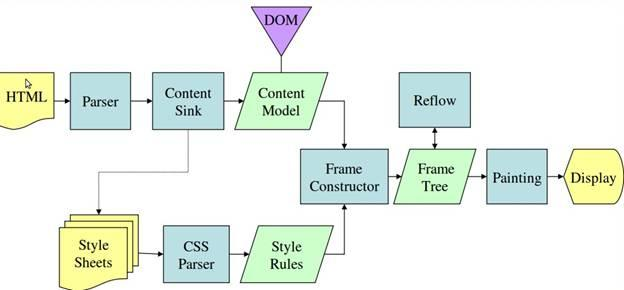

# 从输入 URL 到页面加载完成的过程中都发生了什么事情？

[TOC]


## 序曲

“从输入 URL 到页面加载完成的过程中都发生了什么事情？” 这个问题流传至今，千人千答，但又经久不衰。随着时代的前进，各种“事情”都在变化着，很难有一个标准的答案。

但是，作为一名 Web 开发者，我认为有必要了解并总结，这期间到底发生了什么，作为自身知识体系的结构纵贯线。

“事情”过程涉及的知识广度与深度可尽情拓展，不同的开发人员可能有着不同的理解和答案。本文站在 Web 前端开发者 的角度，探索并总结了这些“事情”。这是站在许多巨人的肩膀上，借鉴、吸收、转换的结果。希望看到本篇的你，若有所思，共同交流。


## 浏览器解析输入

`GUI` 将输入事件传递到了浏览器中，在这过程中，浏览器可能会做一些预处理，比如 `Chrome` 会根据历史统计来预估所输入字符对应的网站，比如输入了「ba」，根据之前的历史发现 90% 的概率会访问「 www.baidu.com 」，因此就会在输入回车前就马上开始建立 `TCP` 链接甚至渲染了，这里面还有很多其它策略。

> 深入了解： [High Performance Networking in Chrome](//aosabook.org/en/posa/high-performance-networking-in-chrome.html)

接着是输入 `URL` 后的「回车」，这时浏览器会对 `URL` 进行检查，首先判断协议，如果是 `http(s)` 就按照 `Web` 来处理，另外还会对 `URL` 进行安全检查，然后直接调用浏览器内核中的对应方法，比如 `WebView` 中的 `loadUrl` 方法。


## DNS 查询

`DNS` 查询是基于 `UDP` 来实现的

`DNS` 查询顺序如下，若其中一步成功则直接跳到建立连接部分：

1. 浏览器自身缓存：缓存时间（TTL）不定，由浏览器控制
2. 操作系统缓存：系统 DNS 查询调用
3. 路由器缓存
4. ISP 缓存
5. 递归搜索：向域名服务器（`NS`）发送请求，直至根域


## 建立连接

- TCP 三次握手（Three-way handshake）：`SYN > SYN-ACK > ACK`
- 目的：确认双方互联网络的连通性，不至于浪费资源。主要流程如下：

  1. 发送方：SYN（Synchronize）
  2. 接收方：SYN/ACK（Acknowledgement）- 确认信息传达
  3. 发送方：ACK - 确认接收方在线可收消息，握手结束
  4. Accept

- 图示：

  
  TCP 三次握手（Three-way handshake）

- 问题：每次 TCP 连接的建立过程都需要增加往返延时，受到客户端与服务端的距离、路由路径等因素影响，建立过程延时与发送的数据量无关。（因此需要适当减少连接数）

- 建立完毕：如果是 `HTTPS` 连接，则额外增加包含 **2次** 往返延时的 `SSL` 握手。如果 `SSL` 会话已经存在缓存，则只需要 **1次** 往返。

## 发送 HTTP 请求数据（Request）

### 请求数据示例

```HTTP
GET / HTTP/1.1

Host: www.baidu.com
Connection: keep-alive
Pragma: no-cache
Cache-Control: no-cache
Upgrade-Insecure-Requests: 1
User-Agent: AppleWebKit/537.36 (KHTML, like Gecko) Chrome/67.0.3396.99 Safari/537.36
DNT: 1
Accept: text/html,application/xhtml+xml,application/xml;q=0.9,image/webp,image/apng,*/*;q=0.8
Accept-Encoding: gzip, deflate, br
Accept-Language: zh-CN,zh;q=0.9
Cookie: foo=1; bar=2
```

### 请求数据结构

1. 报文首部（`GET /index HTTP/1.1`）
    - 方法
    - URL
    - HTTP 版本
2. 空行（CR+LF）
3. 报文主体

### 请求方案

在浏览器内核中会先查看缓存，然后设置 `UA` 等 `HTTP` 信息，接着调用不同平台下网络请求的方法。

> 注意：浏览器和浏览器内核是不同的概念，浏览器指的是 Chrome、Firefox，而浏览器内核则是 Blink、Gecko，浏览器内核只负责渲染，GUI 及网络连接等跨平台工作则是浏览器实现的

### 请求特点

- `HTTP` 请求内容是 **纯文本** 格式的，所以在 `TCP` 的数据段中可以直接分析 `HTTP` 的文本
- `HTTP` 是无连接、无状态的，即 `HTTP` 在传输完成后就会断开，并且下一次登录时不会记录上次的登录状态
- 从 `HTTP/1.1` 开始才支持持久连接，即通信一次以后连接不中断：

  > 正常为请求一次响应一次: 请求1 -> 响应1 -> 请求2 -> 响应2 -> 请求3 -> 响应3
  > 若采用持久连接请求管线化方式： 请求1 -> 请求2 -> 请求3 -> 响应1 -> 响应2 -> 响应3

  使用管线化的条件：

  - 服务端需要支持管线化
  - 只有 `GET` 和 `HEAD` 请求方式可以进行管线化，`POST` 请求有所限制
  - 管线化不会影响响应到来的顺序

- 请求体中的换行符：

  - `Dos` / `Windows`：`CR/LF`
  - `UNIX` / `Linux`：`LF`（Line Feed）
  - `MAC OS`：`CR`（Carriage Return）


## 服务器处理请求

服务器接收请求数据后，根据请求类型将请求交付给不同的处理模块进行处理（读取、存储、更改等）。
处理完毕后，返回相应的处理结果（文本/图像/数据流等）。


## 接收服务器响应数据（Response）

### 响应数据示例

```HTTP
HTTP/1.1 200 OK

Cache-Control: private
Connection: Keep-Alive
Content-Encoding: gzip
Content-Type: text/html
Date: Tue, 10 Jul 2018 07:10:18 GMT
Expires: Tue, 10 Jul 2018 07:10:18 GMT
Server: BWS/1.1
Set-Cookie: BD_HOME=0; path=/
Set-Cookie: FOO=bar; path=/; domain=.baidu.com
Strict-Transport-Security: max-age=172800
Vary: Accept-Encoding
X-Ua-Compatible: IE=Edge,chrome=1
Transfer-Encoding: chunked
```

### 响应数据结构

1. 报文首部（`HTTP/1.1 200 OK`）
    - HTTP 版本
    - 响应状态码
    - 状态码信息
2. 空行（CR+LF）
3. 报文主体


## 分析响应数据

- 如果响应中包含 HTTP 重定向，则需要额外重新发起以上整个请求往返循环过程。
- 如果响应中包含 `Content-Encoding` 头的压缩算法，浏览器将根据相应的算法进行内容解码，还原实际数据
- 缓存：`Cache-Control` 响应头告知浏览器内容缓存时效
- Cookie：`Set-Cookie` 响应头告知浏览器设置相应的客户端 `Cookie`
- 内容类型：`Content-Type` 响应头告知浏览器响应数据的 `MIME` 类型，浏览器根据内部设置，交付给不同的解析器去解析数据（解析或下载等）。响应的资源一般是指 `HTML` 文档，也可以是 `PDF`、图片或其他的类型。

### 延时分析

以最糟糕的典型宽带连接为例（忽略本地缓存）：

1. DNS 解析
2. TCP 握手 (1次 RTT)
3. SSL 握手 (2次 RTTs)
4. 发送请求到服务器
5. 服务器处理
6. 服务器发送相应到客户端

另外：

- 如果服务端响应内容不符合最初的 TCP 拥塞窗口（Congestion Window）（4-15KB），则需要更多额外的往返操作延时
- 如果在建立 SSL 连接过程中，证书不存在，或者需要在线证书状态检查（OCSP）（Online Certificate Status Check），都需要额外建立一次 TCP 连接，这会增加上千毫秒的额外延时

## 解析并渲染页面

> 深入了解：[How Browsers Work](//https://www.html5rocks.com/zh/tutorials/internals/howbrowserswork/)

### 主流程

流程图：

```flow
st=>start: 开始

op1=>operation: 解析 HTML 构建 DOM 树
op2=>operation: 创建 结构树（框架树/呈现树）
op3=>operation: 渲染树 布局（重排）
op4=>operation: 渲染树 绘制

e=>end: 结束

st->op1->op2->op3->op4->e
```

步骤：

- 构建渲染树（Render Tree）：根据 DOM 和 CSSOM 树渲染，不可见元素不被会渲染

  
  构建渲染树（Render Tree）

- 布局（Layout）：CPU 根据渲染树布局计算元素的具体位置和大小，转换成绝对像素，并且根据样式，分割成多个独立的渲染层（Layers），将每一层对应到位图中
- 绘制（Paint）：GPU 根据每个渲染层（Layers）的位图绘制每个点，即像素填充,并且将所以渲染层缓存，如果下次页面变动但是渲染层没变就不会触发重绘。
- 层级合成（Compositing）：顾名思义，即处理多层渲染层之间的关系，将其合成为一个完整的页面。

#### 呈现引擎（Rendering Engine）

负责显示请求的内容。如果请求的内容是 `HTML`，它就负责解析 `HTML` 和 `CSS` 内容，并将解析后的内容显示在屏幕上。

默认情况下，呈现引擎可显示 `HTML` 和 `XML` 文档与图片。通过插件（或浏览器扩展程序），还可以显示其他类型的内容；例如，使用 `PDF` 查看器插件就能显示 `PDF` 文档。

#### 主流程示例

- `Webkit`：Safari / Chrome

  
  WebKit 呈现引擎主流程

- `Gecko`：Firefox

  
  Gecko 呈现引擎主流程

### 解析（Parsing）

#### 概述

解析文档是指将文档转化成为有意义的结构，也就是可让代码理解和使用的结构。解析得到的结果通常是代表了文档结构的节点树，它称作解析树或者语法树。

```flow
st=>start: 源代码（Source Code）

op1=>operation: 分析转换（Parsing）
op2=>operation: 解析树（Parse Tree）
op3=>operation: 翻译（Translation）

e=>end: 机器码（Machine Code）

st->op1->op2->op3->e
```

#### 词法分析（Lexical Analysis）

词法分析是将输入内容分割成大量标记的过程。标记是语言中的词汇，即构成内容的单位。在人类语言中，它相当于语言字典中的单词。

词法分析工具：**词法分析器**（有时也称为标记生成器），负责将输入内容分解成一个个有效标记。词法分析器知道如何将无关的字符（比如空格和换行符）分离出来。

#### 语法分析（Syntax Aalysis）

语法分析是应用语言的语法规则的过程。

语法分析工具：**解析器**，负责根据语言的语法规则分析文档的结构，从而构建解析树。

#### 迭代转换

解析是一个迭代的过程。通常，解析器会向词法分析器请求一个新标记，并尝试将其与某条语法规则进行匹配。如果发现了匹配规则，解析器会将一个对应于该标记的节点添加到解析树中，然后继续请求下一个标记。

如果没有规则可以匹配，解析器就会将标记存储到内部，并继续请求标记，直至找到可与所有内部存储的标记匹配的规则。如果找不到任何匹配规则，解析器就会引发一个异常。这意味着文档无效，包含语法错误。

#### 翻译（Translation）

翻译是指将输入文档转换成另一种格式。编译就是这样一个例子。编译器可将源代码编译成机器代码，具体过程是首先将源代码解析成解析树，然后将解析树翻译成机器代码文档。

#### 解析 HTML（HTML Parser）

##### 语法分析

HTML 无法用常规的自上而下或自下而上的解析器进行解析。
HTML 的特点是：

1. 语言的宽容本质。
2. 浏览器历来对一些常见的无效 HTML 用法采取包容态度。
3. 解析过程需要不断地反复。源内容在解析过程中通常不会改变，但是在 HTML 中，脚本标记如果包含 `document.write`，就会添加额外的标记，这样解析过程实际上就更改了输入内容。

HTML5 规范详细地描述了解析算法。此算法由两个阶段组成：标记化 和 树构建。

浏览器具有很好的容错机制，会纠正任何无效内容，然后继续工作。

##### 生成 DOM

解析的结果是 DOM（Document Object Model），代表 HTML 文档与外部 HTML 元素的接口（如 JavaScript）。

HTML 文本示例：

```HTML
<html>
  <body>
    <p>
      Hello World
    </p>
    <div></div>
  </body>
</html>
```

DOM 树示例：


解析 HTML 构建 DOM 树

#### 解析样式（Style）

##### 样式的来源

- 外部样式表
- inline 样式属性及类似内容
- HTML 可视化属性（映射到相关的样式规则）（例如 `bgcolor` 属性）

##### 样式表的来源

1. 浏览器的默认样式表
2. 网页提供的样式表
3. 浏览器用户提供的用户样式表

##### CSS 解析器（CSS parser）

> 样式表的加载应用虽然不会更改 DOM 树，但可能会影响脚本对文档内容信息获取的结果，因此需要考虑等待样式表并停止文档解析，但并非一致。

- Firefox 在样式表加载和解析的过程中，会禁止所有脚本。
- 而对于 WebKit 而言，仅当脚本尝试访问的样式属性可能受尚未加载的样式表影响时，它才会禁止该脚本。

CSS 语法分析转换：


CSS 语法分析转换

##### 样式计算

计算流程：

1. 划分结构。结构中的属性都是继承的或非继承的。继承属性如果未由元素定义，则继承自其父代；
2. 使用规则树计算样式上下文；
3. 处理规则，简化匹配；
4. 按照规则排列层叠顺序，应用属性。

#### 解析脚本（Script）

#### 内嵌脚本

解析器遇到 `<script>` 标记时，阻塞 DOM 的构建，立即解析并执行脚本。
文档的解析将停止，直到脚本执行完毕。

#### 外链脚本

解析器遇到外部引用脚本，那么 DOM 解析过程会停止，发起一个网络请求，直到 **同步** 抓取资源完成后再继续解析 HTML 构建 DOM。

而当前新式浏览器做了优化，此时会继续下载文档并解析，再次遇到脚本引用时，会新增请求，**并行** 下载脚本（浏览器对并行个数有限制）。但是最终的执行顺序是按照 HTML 文档的脚本顺序先后执行的，同样也会阻塞其他资源的下载。

#### 优化

此模型已经使用了多年，也在 `HTML4` 和 `HTML5` 规范中进行了指定。
可以将脚本标注为 `defer`，这样它就不会停止文档解析，而是等到解析结束才执行。`HTML5` 增加了一个选项，可将脚本标记为异步（`async`），以便由其他线程解析和执行。

#### 解析其他资源

其他资源，比如图像（`img`）等内嵌网络资源，并不会阻塞 DOM 的转换，浏览器仅仅发送额外的请求获取资源，然后继续执行后面的操作，不需等待请求返回。让资源返回后，只需把相应的内容插入到 DOM 树中相应位置即可。

#### 预解析

WebKit 和 Firefox 都进行了这项优化。
在执行脚本时，其他线程会解析文档的其余部分，找出并加载需要通过网络加载的其他资源。
通过这种方式，资源可以在并行连接上加载，从而提高总体速度。
请注意，预解析器不会修改 DOM 树，而是将这项工作交由主解析器处理；
预解析器只会解析外部资源（例如外部脚本、样式表和图片）的引用。

### 解析完毕

浏览器会将文档标注为 **交互状态**，并开始解析那些处于 `deferred` 模式的脚本，也就是那些应在文档解析完成后才执行的脚本。然后，文档状态将设置为 “完成”，一个 “加载” 事件将随之触发。

### 构建呈现树（Render Tree）

在 `DOM` 树构建的同时，浏览器还会构建另一个树结构：**呈现树**。
这是由可视化元素按照其显示顺序而组成的树，也是文档的可视化表示。
作用：让按照正确的顺序绘制内容。

#### 呈现树和 DOM 树的关系

呈现器是和 `DOM` 元素相对应的，但并非一一对应。
非可视化的 `DOM` 元素不会插入呈现树中，例如 `<head>` 元素。如果元素的 `display` 属性值为 `none`，那么也不会显示在呈现树中（但是 `visibility` 属性值为 `hidden` 的元素仍会显示）。
有一些 DOM 元素对应多个可视化对象。例如 `<select>`


呈现树和 DOM 树的关系

初始容器 `block` 为 `viewport`，而在 WebKit 中则为 `RenderView` 对象

#### 渐进式处理

WebKit 使用一个标记来表示是否所有的顶级样式表（包括 `@imports`）均已加载完毕。如果在附加过程中尚未完全加载样式，则使用占位符，并在文档中进行标注，等样式表加载完毕后再重新计算。

### 布局（Layout）

呈现器在创建完成并添加到呈现树时，并不包含位置和大小信息。计算这些值的过程称为布局或重排。

布局是一个基于流的递归的过程。它从根呈现器（对应于 HTML 文档的 `<html>` 元素）开始，然后递归遍历部分或所有的框架层次结构，为每一个需要计算的呈现器计算几何信息。

- 全局布局：

  - 影响所有呈现器的全局样式更改（例如全局字体大小）。
  - 屏幕大小调整。

- 增量布局：异步执行，只对 `dirty` 呈现器进行布局（这样可能存在需要进行额外布局的弊端）。当呈现器为 `dirty` 时，会异步触发增量布局

### 绘制（Paint）

在绘制阶段，系统会遍历呈现树，并调用呈现器的 `paint` 方法，将呈现器的内容显示在屏幕上。绘制工作是使用用户界面基础组件完成的。

- 全局绘制：绘制整个呈现树
- 增量绘制：部分呈现器发生了更改，但是不会影响整个树。更改后的呈现器将其在屏幕上对应的矩形区域设为无效，这导致 OS 将其视为一块“dirty 区域”，并生成“paint”事件

呈现树的绘制顺序：

1. 背景颜色
2. 背景图片
3. 边框
4. 子代
5. 轮廓

> 参考：[CSS2 绘制顺序规范](//www.w3.org/TR/CSS21/zindex.html)

### 动态变化

在发生变化时，浏览器会尽可能做出最小的响应。

- 颜色改变后，只会对该元素进行重绘。
- 位置改变后，只会对该元素及其子元素（可能还有同级元素）进行布局和重绘。
- 添加 DOM 节点后，会对该节点进行布局和重绘。
- 一些重大变化（例如增大“html”元素的字体）会导致缓存无效，使得整个呈现树都会进行重新布局和绘制。

### 呈现引擎和事件循环（Event Loop）

呈现引擎采用了单线程。几乎所有操作（除了网络操作）都是在单线程中进行的。在 Firefox 和 Safari 中，该线程就是浏览器的主线程。而在 Chrome 浏览器中，该线程是标签进程的主线程。
网络操作可由多个并行线程执行。并行连接数是有限的（通常为 2 至 6 个，以 Firefox 3 为例是 6 个）。

浏览器的主线程是 **事件循环**。
它是一个 **无限循环**，永远处于接受处理状态，并等待事件（如布局、绘制、用户点击、系统事件等）发生，并进行处理。


## [参考资料]

- [从输入 URL 到页面加载完成的过程中都发生了什么事情？](//fex.baidu.com/blog/2014/05/what-happen/)
- [Network-当我们在浏览器中输入一个URL后，发生了什么？](//yuque.com/iwantoffer/notebook/wsd0ud)
- [What really happens when you navigate to a URL](//igoro.com/archive/what-really-happens-when-you-navigate-to-a-url/)
- [How Browsers Work](//www.html5rocks.com/en/tutorials/internals/howbrowserswork/)
- [High Performance Networking in Chrome](//aosabook.org/en/posa/high-performance-networking-in-chrome.html)
- [网页性能之HTML,CSS,JavaScript](//www.alloyteam.com/2015/05/wang-ye-xing-neng-zhi-html-css-javascript/)

